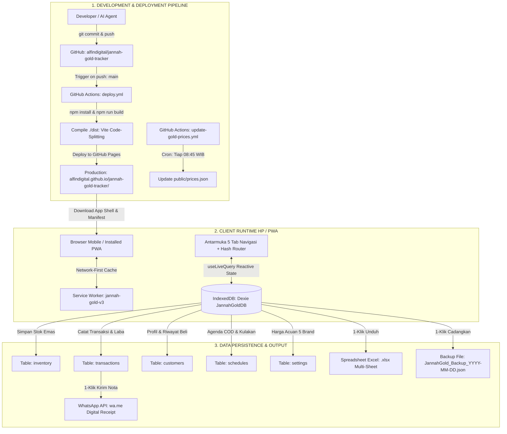

# 📜 MASTER HANDOVER & HINDSIGHT — JANNAH GOLD PWA

> **DOKUMEN INDUK SERAH TERIMA & KNOWLEDGE BASE AI / DEVELOPER**  
> *Tanggal Pembaruan*: 05 September 2026  
> *Status*: 100% Selesai, Teruji, dan Aktif di Lingkungan Produksi (LIVE).  
> *Production URL*: [https://alfindigital.github.io/jannah-gold-tracker/](https://alfindigital.github.io/jannah-gold-tracker/)  
> *Repository*: [https://github.com/alfindigital/jannah-gold-tracker](https://github.com/alfindigital/jannah-gold-tracker) (Branch: `main`)

---

## 1. Konteks & Identitas Bisnis

* **Nama Usaha**: **Jannah Gold** (Toko Emas & Investasi Logam Mulia Fisik Independen).
* **Basis Operasional**: Kabupaten Purbalingga, Jawa Tengah (Area COD: Purbalingga Kota, Kalimanah, Padamara, Bobotsari, Kutasari, Bukateja).
* **Produk Utama**:
  - Emas Batangan Logam Mulia (LM) bersertifikat: Antam Certicard, UBS, Galeri 24, Hartadinata, Lotus Archi (pecahan 0.5g s/d 100g).
  - Perhiasan emas & koin emas.
* **Model Bisnis**:
  - Penjualan langsung & sistem COD (Cash on Delivery) di titik temu terpercaya.
  - Buyback emas fisik tunai resmi.
  - Sistem konsinyasi / titipan reseller lokal Purbalingga.
  - Strategi pemasaran dominasi 3 Titik Google Business Profile (GBP).
* **Tujuan Aplikasi**: Menggantikan pembukuan manual/Excel dengan aplikasi mobile-first PWA yang cepat, aman, otomatis menghitung HPP & laba bersih, mengelola inventori, CRM pelanggan, dan mempermudah pengiriman nota transaksi via WhatsApp.

---

## 2. Blueprint Teknis & Framework Stack

### A. Arsitektur Inti
* **Runtime & Framework**: React 18 (Functional Components + Hooks).
* **Build Engine & Bundler**: Vite v6.4+ dengan konfigurasi `manualChunks` untuk code-splitting.
* **Styling & Design System**: Tailwind CSS v3.4 + PostCSS + Autoprefixer.
  - *Theme*: **Luxury Imperial Champagne Gold & Swiss Clean Light** (`#F6F3EC`, `#1B1814`, `#D4AF37`, `#A27B2C`, `#E5C378`).
  - *Typography*: Bricolage Grotesque (Heading) + Sora (Body) + Geist Mono (Angka/Nominal).
* **Database & Persistence**: **Local-First IndexedDB** melalui library `dexie` (v4) & `dexie-react-hooks`.
  - Database Name: `JannahGoldDB` (Schema v1).
* **PWA & Offline Capability**:
  - Service Worker kustom (`public/sw.js`, cache key: `jannah-gold-v3`, strategi: *Network-First* dengan fallback offline ke cached shell).
  - Web App Manifest (`public/manifest.json`, standalone mode, start_url `./`, icons `logo.png`).
* **Libraries & Utilitas**:
  - `lucide-react`: Ikon antarmuka.
  - `xlsx` (SheetJS): Generator spreadsheet multi-sheet (.xlsx).
  - `canvas-confetti`: Animasi mikro perayaan transaksi lunas.

---

## 3. Workflow Sistem: Alur Input, Proses, & Output



### Rincian Routing & Halaman:
Sistem menggunakan **Hash URL Routing** (`window.location.hash`) tanpa ketergantungan library router eksternal, sehingga aman saat refresh di GitHub Pages dan mendukung tombol *Back/Forward* perangkat HP:
1. `/#/dashboard`: Ringkasan 4 kartu Bento (Profit, Stok, Modal, Valuasi), Stok terbaru, Agenda aktif, Mini-table harga (Antam + UBS).
2. `/#/schedule`: Manajemen agenda COD pengantaran & belanja kulakan, tombol arah rute Google Maps, shortcut WhatsApp, dan tombol "Catat Laku" otomatis.
3. `/#/inventory`: Katalog stok emas ready/booked/sold, filter brand & gramasi, form pembelian stok baru, dan tombol quick sell "Jual".
4. `/#/crm`: Database pelanggan, agregasi LTV, total gramasi dibeli, badge loyalitas (VIP/Langganan), riwayat pembelian terperinci, dan tombol kirim ulang nota.
5. `/#/reports`: Laporan laba rugi bulanan/semua periode, pencatatan transaksi penjualan, generator nota digital WA, ekspor 4-sheet Excel, serta panel Backup & Restore JSON.
6. `/#/gold-prices`: Halaman khusus tabel acuan harga 5 brand (Antam, UBS, Galeri 24, Hartadinata, Lotus Archi) dengan inline editing per baris dan tombol "Tarik Online".

---

## 4. Kronologi Riwayat Keputusan Penting (Chat History Summary)

Berikut adalah evolusi penting dari awal hingga kondisi final saat ini:
1. **Pemisahan Tab CRM**: Menu CRM awalnya tersembunyi di sub-tab keuangan. Pengguna meminta CRM dibuat menjadi tab mandiri (icon orang) di navigasi bawah, menghasilkan 5 tab utama.
2. **Penyelarasan Layout**: Memperbaiki offside lebar container header agar sejajar rata pixel-perfect dengan kartu bento body.
3. **Pemberian Identitas Hash URL**: Migrasi dari tab berbasis state murni ke Hash Routing (`#/tab`) agar URL bisa di-bookmark, di-refresh, dan tombol *back* browser tidak keluar aplikasi.
4. **Penyederhanaan Teks & Visual Dashboard**:
   - Judul Bento Card direvisi menjadi 1 kata padat: `PROFIT`, `STOK`, `MODAL`, `VALUASI`.
   - Judul seksi diubah menjadi `STOK` dan `JADWAL`.
   - Menghapus badge kotak abu-abu gram (`10g`, `3.2g`) pada list stok agar menjadi full text bersih.
   - Memisahkan Tanggal & Lokasi pada kartu jadwal menjadi 2 baris (bukan berdampingan).
   - Menghilangkan awalan `Rp` pada list item (`formatJuta`) untuk mencegah angka patah baris di layar kecil.
5. **Redesain Harga Emas Multi-Brand**:
   - Di dashboard cukup tampil mini-table 2 brand (Antam & UBS) dengan kolom Jual/g dan Buyback/g.
   - Tombol "Lihat Semua →" mengarahkan ke halaman baru `/#/gold-prices` dengan tabel 5 brand lengkap dan inline edit.
6. **Eksekusi 6 Solusi Roasting (Technical Upgrades)**:
   - *Data Safety*: Menambahkan fitur 1-klik Backup & Restore JSON di tab Keuangan untuk mencegah bencana data saat HP rusak/ganti.
   - *UX Unifikasi*: Menghapus modal lama `GoldPriceModal.jsx`. Klik kartu `VALUASI` langsung membuka `/#/gold-prices`.
   - *Vite Code-Splitting*: Memecah bundle monolitik 628 kB menjadi modular: `index` (95 kB), `vendor-react` (255 kB), `vendor-xlsx` (283 kB).
   - *Alur Aktif COD*: Tombol "Selesai" pada COD langsung memunculkan prompt untuk mencatat transaksi penjualan dengan form yang terisi otomatis (nama, WhatsApp, nominal, lokasi).
   - *Otomasi Harga Online*: Menambahkan `public/prices.json`, GitHub Actions cron harian jam 08:45 WIB, dan tombol "Tarik Online" di PWA.
   - *Struk Nota Digital WhatsApp*: Menambahkan generator nota resmi berformat rapi untuk dikirim via WhatsApp dengan 1 klik.

---

## 5. Hindsight & Catatan Khusus Teknis (Wajib Diketahui AI Penerus)

1. **PowerShell Quote Escaping di Windows**:
   - *JANGAN* menjalankan skrip inline kompleks melalui PowerShell seperti `node -e "..."` atau `python -c "..."` jika terdapat karakter kutip satu `'` atau regex `[...]`, karena PowerShell Windows akan merusak string tersebut.
   - *Gunakan*: Selalu tuliskan skrip ke dalam file temporer atau gunakan here-string `@' ... '@` (kutip tunggal) saat mengeksekusi via PowerShell.
2. **Karakteristik UTF-8 BOM pada Windows**:
   - Perintah `Set-Content -Encoding UTF8` di Windows PowerShell 5.1 otomatis menyematkan header BOM (Byte Order Mark `\xef\xbb\xbf`). Ini menyebabkan `JSON.parse` gagal jika file JSON dibaca oleh parser non-browser.
   - Pastikan file JSON (seperti `prices.json`) disimpan dengan encoding UTF-8 standar tanpa BOM.
3. **Penyimpanan Data Local-First (Dexie.js)**:
   - Database tersimpan di IndexedDB browser klien masing-masing.
   - Perubahan data yang dilakukan di browser laptop TIDAK otomatis muncul di browser HP istri kecuali jika data dicadangkan via tombol JSON dan dipulihkan di perangkat tujuan, ATAU diintegrasikan dengan backend cloud sync.
4. **Alur Quick Sell di App.jsx**:
   - Objek `quickSellItem` di `App.jsx` menangani dua sumber:
     - Dari `InventoryTab`: membawa `id`, `title`, `weight`, `totalBuyPrice`.
     - Dari `ScheduleTab` (Convert COD): membawa `customerName`, `customerPhone`, `sellPrice`, `notes`.
   - `FinancialReportTab` menangani kedua skenario tersebut dengan aman di dalam `useEffect([quickSellItem])`.
5. **Format Angka & Mata Uang**:
   - Gunakan `formatJuta(val)` untuk badge ringkas di list item tanpa prefix Rp (`13,5 jt`, `710 rb`).
   - Gunakan `formatRupiahJuta(val)` untuk kartu bento (`Rp 13,5 jt`).
   - Gunakan `formatRupiah(val)` untuk angka penuh di nota dan modal (`Rp 1.455.000`).

---

## 6. Struktur Berkas Saat Ini

```
c:\Users\GEEKOM A8\Desktop\Jannah Gold\
├── README.md                      # Peta navigasi utama workspace
├── HINDSIGHT_AND_HANDOVER.md      # [DOKUMEN INI] Panduan serah terima & arsitektur
├── PROJECT.md                     # Arsip spesifikasi teknis
├── TEST_INFRA.md                  # Panduan infrastruktur uji E2E
│
├── pwa-gold-tracker/              # REPOSITORI UTAMA APLIKASI (Live Git Repo)
│   ├── .github/workflows/
│   │   ├── deploy.yml             # Auto deploy CI/CD ke GitHub Pages
│   │   └── update-gold-prices.yml # Cron scraper harian acuan harga emas (08:45 WIB)
│   ├── public/
│   │   ├── manifest.json          # PWA Manifest
│   │   ├── sw.js                  # Service Worker (Network-First)
│   │   ├── logo.png               # App Icon 512px
│   │   └── prices.json            # Acuan harga pasar online terkini
│   ├── src/
│   │   ├── App.jsx                # Root router hash & state orchestrator
│   │   ├── main.jsx               # React DOM entry
│   │   ├── index.css              # Tailwind directives & luxury fonts
│   │   ├── db/
│   │   │   ├── db.js              # Dexie instance, schemas, status constants
│   │   │   └── seed.js            # Realistic Indonesian initial seed data
│   │   ├── services/
│   │   │   ├── calculationService.js # Math, formatting, WhatsApp receipt generator
│   │   │   └── exportService.js      # 4-sheet Excel export & JSON backup/restore
│   │   └── components/
│   │       ├── common/ (Badge.jsx, Modal.jsx)
│   │       ├── layout/ (Header.jsx, BottomNav.jsx)
│   │       ├── dashboard/ (DashboardTab.jsx)
│   │       ├── goldprices/ (GoldPricesTab.jsx)
│   │       ├── schedule/ (ScheduleTab.jsx)
│   │       ├── inventory/ (InventoryTab.jsx)
│   │       ├── crm/ (CrmTab.jsx)
│   │       └── reports/ (FinancialReportTab.jsx)
│   ├── index.html                 # HTML shell, fonts preload, PWA tags
│   ├── package.json               # Dependencies & build scripts
│   ├── tailwind.config.js         # Theme luxury gold tokens
│   └── vite.config.js             # Rollup manualChunks configuration
│
├── strategi-bisnis/               # Dokumen rencana operasional & marketing lokal
│   ├── MASTER-PLAN-3-TITIK-2026-08-29.md
│   ├── plan-marketing-lokal-purbalingga-2026-08-29.md
│   ├── sistem-titipan-dan-reseller-2026-08-29.md
│   ├── roadmap-eksekusi-2026-08-29.md
│   ├── playbook-review-dan-konten-90hari.md
│   └── grill-jannah-gold-2026-08-29.md
│
├── google-business-profile/       # Aset setup Google Business Profile 3 titik
│   ├── draft-gbp-titik1-jannah-gold.md
│   ├── draft-gbp-titik2-lm-purbalingga.md
│   ├── draft-gbp-titik3-lm-kecamatan.md
│   ├── syarat-fisik-dan-verifikasi-titik-2-3.md
│   └── katalog-produk-36-titik1.md
│
└── _archive/                      # Data mentah scraping, riset lama, dan log awal
```

---

## 7. Rekomendasi Next Steps untuk Pengembangan Berikutnya

Jika ada sesi lanjutan atau AI lain yang meneruskan proyek ini, berikut adalah prioritas pengembangan bernilai tinggi yang siap diimplementasikan:

1. **Sinkronisasi Multi-Device Cloud Ringan (Supabase / Firebase / Cloudflare D1)**:
   - Saat ini data tersimpan lokal di masing-masing perangkat.
   - Langkah selanjutnya: Tambahkan opsi login akun pemilik untuk menyinkronkan data IndexedDB secara realtime antara HP istri (saat transaksi di lapangan) dan laptop pemilik (saat rekapitulasi malam hari).
2. **Kalkulator Tukar Tambah (Trade-in) Emas Bekas**:
   - Konsumen sering membawa emas perhiasan lama berkadar rendah (16K/18K/22K) untuk ditukar dengan Antam 24K baru.
   - Buat modul kalkulator instan: input gramasi lama & kadar ➔ potong ongkos lebur ➔ hitung sisa nominal yang harus ditambah pembeli.
3. **Generator Gambar Struk / Nota Grafis (HTML-to-Image / Canvas)**:
   - Saat ini nota dikirim dalam bentuk teks WhatsApp terformat tebal/miring.
   - Dapat ditingkatkan dengan tombol unduh gambar nota digital estetik berlatar emas mewah berlogo Jannah Gold untuk disimpan ke galeri atau status WhatsApp.
4. **Generator Pesan Broadcast WhatsApp Harian**:
   - Fitur 1-klik di tab Stok: *"Buat Broadcast Stok Ready Hari Ini"*.
   - Otomatis merangkum daftar stok batangan yang tersedia hari itu dengan harga acuan hari ini untuk dikirim ke grup WhatsApp arisan emas atau reseller.
5. **Kustom Domain (Custom Domain Setup)**:
   - Hubungkan GitHub Pages atau Vercel ke domain resmi seperti `app.jannahgold.com` atau `jannahgold.com`.
